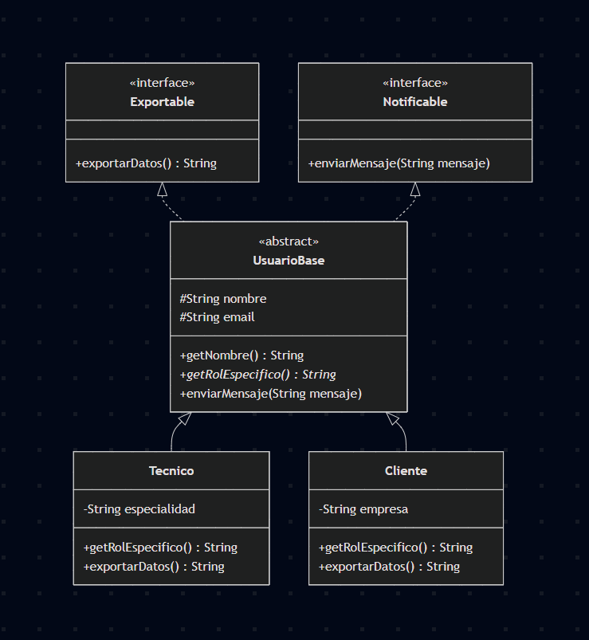

# Diseño de Abstracciones - Jornada 08

## 1. Puntos de Abstracción Detectados

Tras analizar el modelo de dominio creado en la jornada anterior, se han identificado los siguientes puntos donde la abstracción aporta reutilización real y evita un diseño rígido:

### Jerarquía de Clases (Herencia)

- **`UsuarioBase` (Clase Abstracta):**
  - _Justificación:_ En el sistema existen distintos perfiles (ej. Técnico, Cliente, Administrador). Todos comparten atributos básicos (nombre, email) y lógica común (como validar el email), pero tendrán comportamientos específicos (un Técnico resuelve incidencias, un Cliente solo las crea). Usar una clase abstracta `UsuarioBase` centraliza el código común y evita que se instancien "Usuarios genéricos" sin un rol definido, evitando herencias forzadas.

### Interfaces Funcionales (Composición y Contratos)

- **`Exportable` (Interfaz):**
  - _Justificación:_ Necesitamos exportar la información del sistema para auditorías o copias de seguridad. Distintas entidades, como `Incidencia` o `UsuarioBase`, implementarán esta interfaz. Esto garantiza que todas tengan un método `exportarDatos()`, permitiendo tratarlas de forma polimórfica (ej. exportar listas mixtas a formato CSV o JSON) sin importar de qué clase exacta sean.
- **`Notificable` (Interfaz):**
  - _Justificación:_ El sistema debe avisar a los usuarios cuando una incidencia cambia de estado. En lugar de meter la lógica de correos electrónicos dentro de la clase `Incidencia` (lo cual generaría un acoplamiento excesivo), creamos una interfaz `Notificable`. Esto permite crear implementaciones distintas (NotificacionEmail, NotificacionSMS) y pasárselas a la incidencia.

## 2. Diagrama Actualizado (Jerarquías e Interfaces)

## 3. Informe de Decisiones de Diseño y Reflexión (Bloque 4)

### Reflexión sobre errores de diseño evitados

Durante el planteamiento de la jornada, se han analizado posibles defectos de diseño estructural y se han aplicado las siguientes correcciones:

- **Herencia innecesaria / artificial:** Se ha evitado que entidades inconexas (ej. `Activo`) hereden de una clase genérica solo para compartir un ID. La herencia se ha restringido únicamente a relaciones "ES UN" (ej. un `Tecnico` _es un_ `UsuarioBase`).
- **Acoplamiento excesivo:** En lugar de incrustar el código de envío de emails dentro de la clase `Incidencia`, se ha extraído a la interfaz `Notificable`. Si mañana el sistema cambia de Email a SMS, la clase principal no se ve afectada.
- **Métodos vacíos y clases demasiado grandes:** Obligar a que una clase normal actúe como "dios" genera métodos que no se usan. Al separar comportamientos en pequeñas interfaces (`Exportable`), solo las clases que realmente necesiten exportarse implementarán el código.

### Resumen de Ventajas e Inconvenientes del Polimorfismo

**Ventajas:**

- **Reutilización real:** Permite procesar listas enteras de objetos diferentes (Técnicos, Clientes) con un solo bucle `for`, sin necesidad de duplicar el código.
- **Escalabilidad (Open/Closed Principle):** Si mañana añadimos un nuevo perfil `Administrador`, el código que itera y exporta los datos no tendrá que modificarse en absoluto.

**Inconvenientes:**

- **Trazabilidad:** Al depurar (debuggear) el código, puede ser más difícil seguir el flujo de ejecución, ya que en tiempo de compilación no siempre es evidente qué implementación exacta del método (la del Técnico o la del Cliente) se va a ejecutar.
