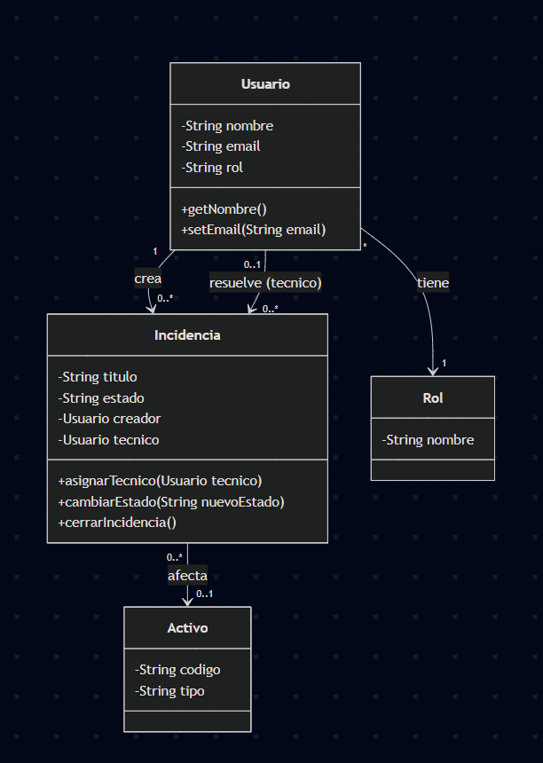

# Modelo de Dominio

## 1. Tabla de Análisis de Entidades y Atributos Clave

| Entidad        | Atributos Clave                                              | Descripción / Restricciones                         |
| :------------- | :----------------------------------------------------------- | :-------------------------------------------------- |
| **Usuario**    | id, nombre, email, password, rol                             | `email` debe ser válido. `password` encapsulado.    |
| **Rol**        | id, nombre, nivelPermiso                                     | Define los privilegios dentro del sistema.          |
| **Activo**     | id, codigoInventario, tipo, estado                           | `codigoInventario` único.                           |
| **Incidencia** | id, titulo, descripcion, estado, prioridad, creador, tecnico | `estado` inicia en 'Abierta'.                       |
| **Comentario** | id, texto, fecha, autor                                      | Asociado a una incidencia específica.               |
| **Categoría**  | id, nombre                                                   | Clasificación del problema (Hardware, Software...). |
| **Adjunto**    | id, urlArchivo, tipo                                         | Archivos subidos a la incidencia.                   |
| **Auditoría**  | id, accion, fecha, usuarioId                                 | Registro inmutable de cambios críticos.             |

## 2. Diagrama de Clases (Versión 1)

## 3. Posibles futuras restricciones

- **Usuarios y Roles:** Un usuario solo podrá tener un rol activo a la vez en el sistema. No se podrá eliminar un rol si existen usuarios vinculados a él.
- **Incidencias:** Una incidencia no podrá pasar al estado "Cerrada" si previamente no tiene un técnico asignado.
- **Activos:** Si un activo (hardware/software) está marcado con el estado "Dado de baja", el sistema impedirá que se le asocien nuevas incidencias.
